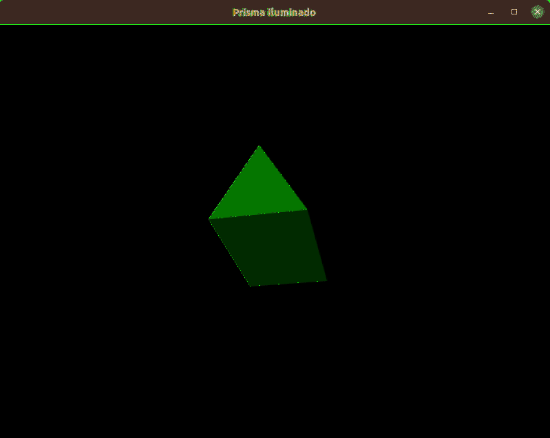

# Prisma Iluminado

 

### Tecnologias
- Python 3.8.
- OpenGL 2.

 

### Trabalho

Esse trabalho tem como objetivo implementar um prisma iluminado de N lados, pelo OpenGL. Para a implementação foi escolhido o GLUT. 

Para definir a quantidade de lados do prisma de forma dinâmica, algumas interações foram inseridas, são elas:
- Cliques do mouse aumentam (lado direito) e diminuem (lado esquerdo) a quantidade de lados do prisma.

  

