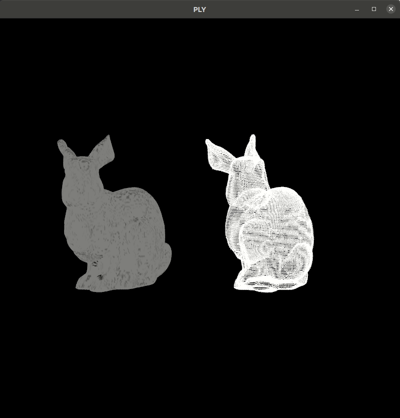

# Objetos PLY

 

### Tecnologias
- Python 3.8.
- OpenGL 2.

 

### Trabalho

Esse trabalho tem como objetivo renderizar um objeto PLY utilizando python nativo, ou seja, sem utilizar uma biblioteca externa. O objeto escolhido foi o *bunny*, retirado dos modelos de [Stanford](http://graphics.stanford.edu/data/3Dscanrep/).

Para renderização foi criada uma classe para extrair os vértices e faces de dentro do arquivo, e retornar uma lista com essas informações. Além disso, é possível extrair as informações do *header*, como a quantidade de vertices e faces.

Abaixo pode ser visto a renderização das faces, a esquerda, e dos vértices, a direita.

