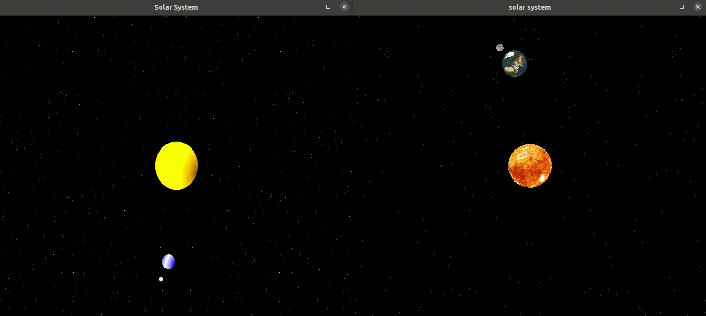

# Textura

 

### Tecnologias
- Python 3.8.
- OpenGL 2.

 

### Trabalho

Esse trabalho tem como objetivo criar um modelo de sistema solar que inclua o sol, a terra e a lua. Além do modelo, foi incluido textura em cada um dos astros. Foi gerado também posições aleatórias para representar as estrelas. Para a implementação foi escolhido o GLUT. 

As texturas utilizadas foram as mostradas abaixo:

 

 

### Resultados

Abaixo podemos ver como ficou o resultado do programa com e sex textura:

 

### Creditos

Para leitura da imagem no formato `png` foi utilizado o programa de Johann C. Rocholl.