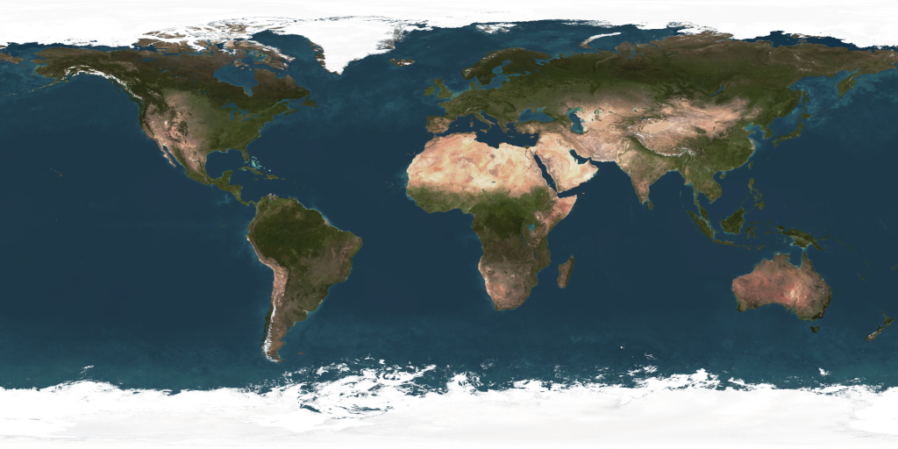

# Textura Planeta

 

### Tecnologias
- Python 3.8.
- OpenGL 2.

 

### Trabalho

Esse trabalho tem como objetivo de aplicar textura do planeta Terra em uma esfera, pelo OpenGL. Além da textura foram incluidos a translação da Terra e as estrelas. Para a implementação foi escolhido o GLUT. 

A textura utilizada foi a mostrada abaixo:

 

### Resultados

Abaixo podemos ver como ficou o resultado do programa:

 

### Creditos

Para leitura da imagem no formato `png` foi utilizado o programa de Johann C. Rocholl.